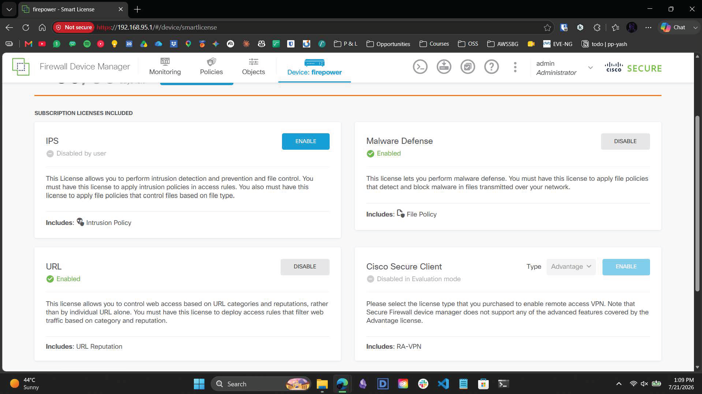
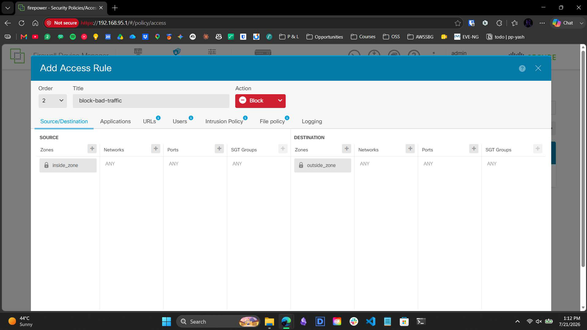
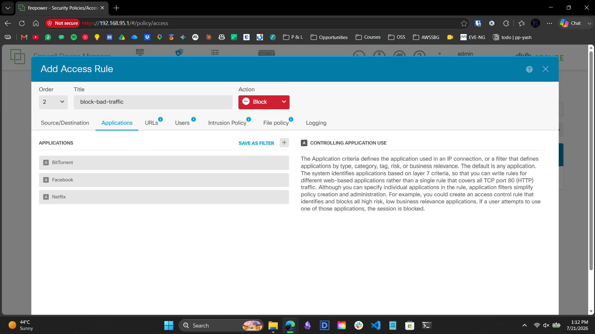
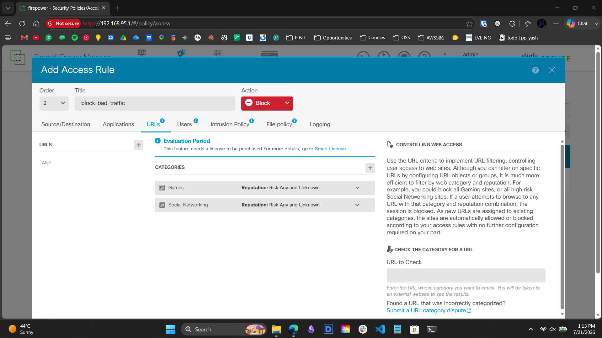
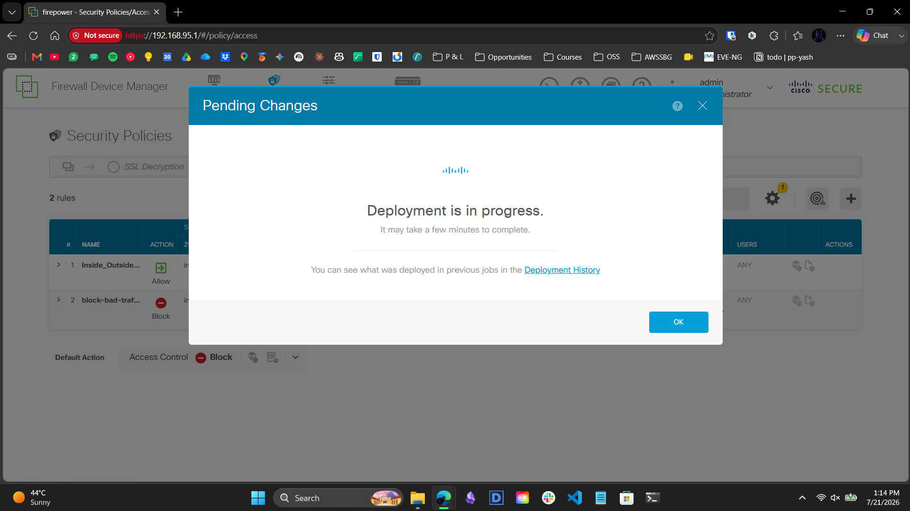
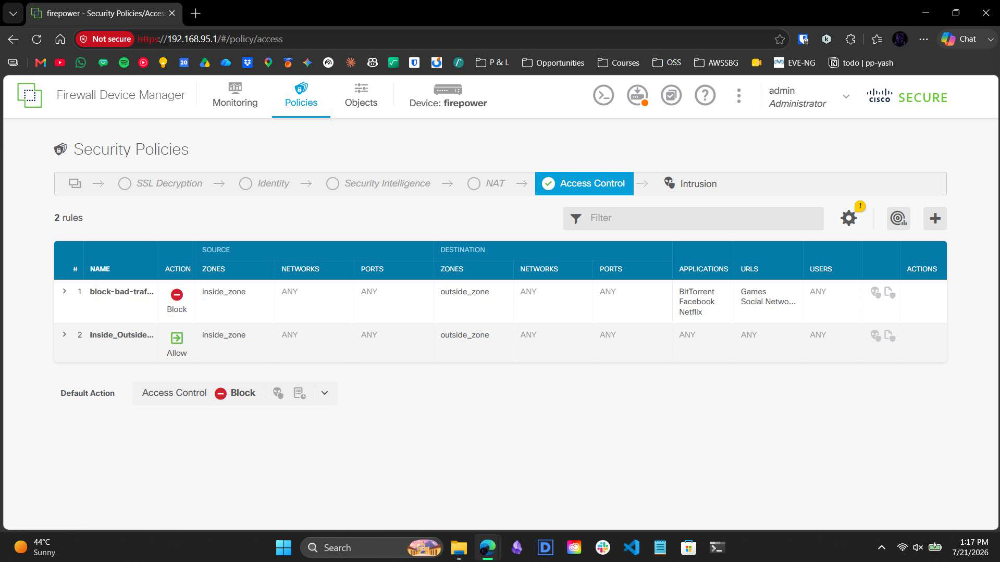

# 3.2 – Infrastructure Build Guide: Layer 7 Application Control & URL Categorization

> A visual narrative documenting the deployment of Layer 7 payload filtering, URL categorization, and the remediation of access rule shadowing on a Cisco Secure Firewall 3105.

---

## Overview

This guide provides a comprehensive breakdown of deploying deep packet inspection (DPI) capabilities via the Firepower Device Manager (FDM). It details the transition from validating Smart Licenses to enforcing strict application signatures, culminating in a real-world troubleshooting scenario involving top-down access control matrix logic.

---

## Workflow Steps

### 1. Act I: Licensing & Deep Packet Priming
To enforce granular, Layer 7 payload inspection, the firewall's subscription architecture required validation. 

* Navigation to the Smart License portal confirmed that Malware Defense and URL filtering capabilities were successfully enabled under the 90-day evaluation parameters.
* The Intrusion Prevention System (IPS) engine was also verified, priming the internal Snort engine for DPI beyond standard Layer 3/4 port and IP analysis.

### 2. Act II: Policy Instantiation & Payload Targeting
With the DPI engines primed, a targeted security policy was required to enforce the new restrictions. 

* An access rule named `block-bad-traffic` was instantiated in the FDM. 
* The rule was configured to intercept traffic flowing from the `inside_zone` to the `outside_zone` and was assigned a strict "Block" action.

* Leveraging the Application filtering definitions, we isolated specific high-bandwidth and time-wasting signatures. 
* BitTorrent, Facebook, and Netflix were explicitly tagged as selected applications for the block condition.

* Moving to the URL categorization engine, broad reputation blocks were applied to the 'Games' and 'Social Networking' categories to halt DNS and HTTP/S requests matching Cisco's Talos threat intelligence feeds.

### 3. Act III: The Shadowing Conflict & Top-Down Processing
During final deployment staging, a structural logic conflict was identified in the Access Control matrix. FTD access policies operate on a strict top-down, first-match execution model.

* The newly constructed `block-bad-traffic` rule was placed at Order #2, directly beneath the highly permissive `Inside_Outside` rule (Order #1), which allowed ANY application and ANY URL. 
* Because of the top-down logic, the permissive rule effectively shadowed the restricted rule. Traffic matching the block parameters would be prematurely allowed by Rule 1, rendering Rule 2 inert.
* Despite the sequencing error, the configuration was pushed to the ASIC routing engine (as seen in the deployment progress window) to validate the deployment pipeline.

### 4. Act IV: Hardware Remediation
To enforce the block logic, the matrix sequence required manual intervention. Subsequent remediation required dragging the restrictive block policy to Order #1 to ensure the drop logic processes before the permissive catch-all rule.

* The Access Control matrix was successfully restructured. 
* The `block-bad-traffic` rule (Order #1) now correctly precedes the permissive `Inside_Outside` rule (Order #2), ensuring that application drops and URL categorizations are processed first by the hardware.

---

## Contact

For any questions or feedback, reach out:  
**Paarth Pandey** | [LinkedIn](https://www.linkedin.com) | [GitHub](https://github.com) | paarthdxb@gmail.com

---

> Author: Paarth Pandey
> 
> Enterprise IT/OT Infrastructure Security Lab Portfolio