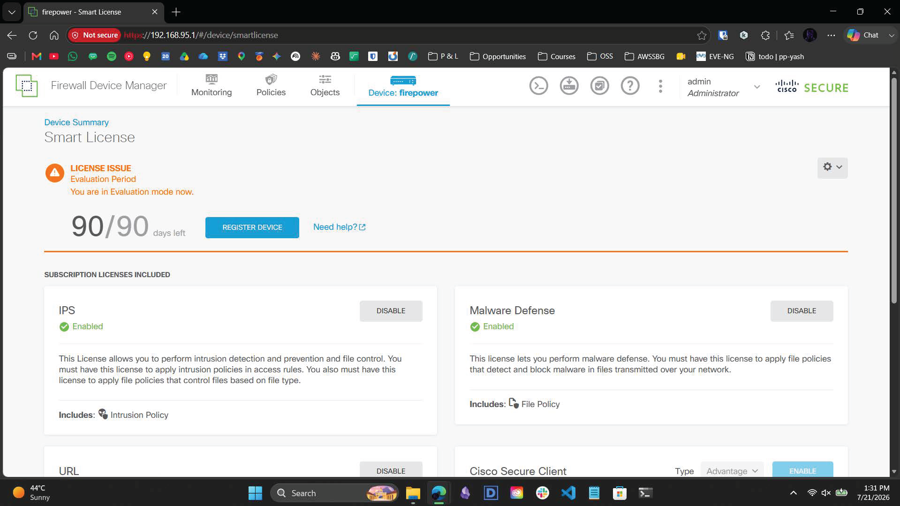
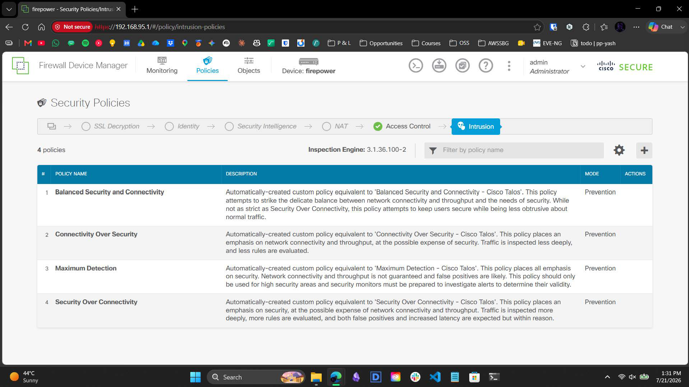
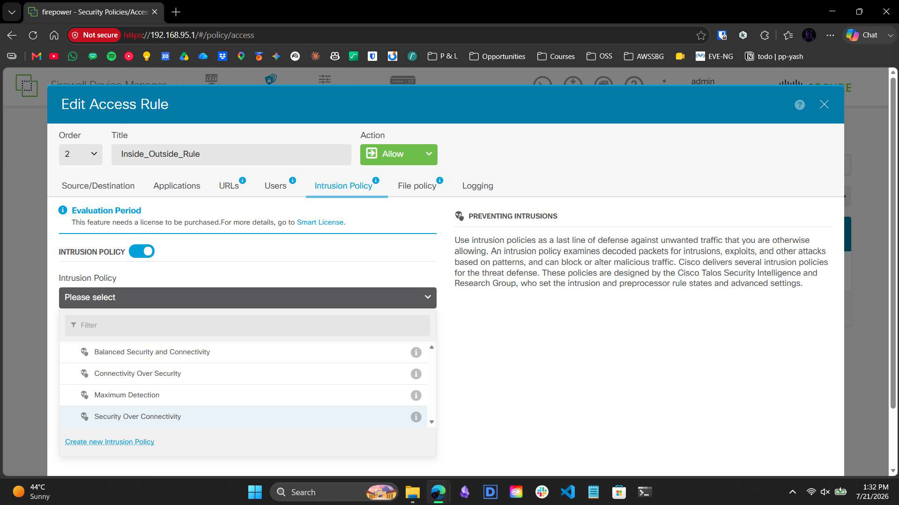
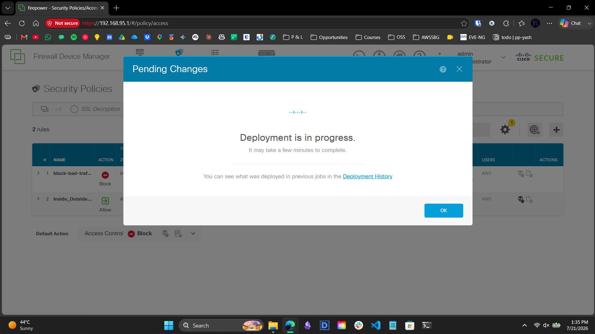
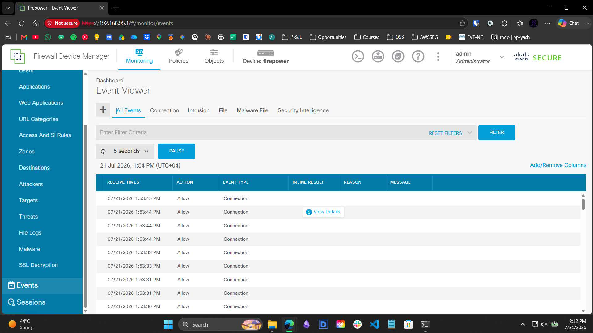

# 3.3 – Infrastructure Build Guide: Snort 3 IPS Integration & Evasion Testing

> A visual narrative documenting the deployment of the Snort 3 IPS engine, permissive policy binding, and the validation of Protocol Preprocessing logic via simulated network evasion.

---

## Overview

This guide provides a comprehensive breakdown of integrating the Cisco Snort 3 Intrusion Prevention System (IPS) via the Firepower Device Manager (FDM). It details the architectural requirement of binding IPS policies exclusively to permissive access rules and validates the engine's active monitoring and Protocol Preprocessing behavior against simulated exploit injections.

---

## Workflow Steps

### 1. Act I: The Deep Packet Inspection Constraint & Licensing
The objective was to deploy the Cisco Snort 3 IPS engine to actively defend the internal Dell Precision workstation segment from network-borne threats. 

*Initial validation within the Smart License portal confirmed the IPS and Malware Defense subscription licenses were successfully enabled and active.*

An initial Access Control matrix audit confirmed a critical architectural constraint: Intrusion Policies cannot be attached to explicit Block rules. Packets subjected to drop actions are immediately discarded by the ASIC routing engine before deep packet inspection can occur, actively conserving critical CPU processing overhead. 

### 2. Act II: Policy Binding and Engine Compilation
To enforce inspection on active transit traffic, a robust intrusion policy had to be selected and bound to a permissive rule.

*The FDM Intrusion Policies database (Inspection Engine: 3.1.36.100-2) displaying the available matrices. The `Security Over Connectivity` Cisco Talos policy was selected for its strict emphasis on security and deep rule evaluation.*

*The selected Talos Security Over Connectivity policy was bound exclusively to the permissive `Inside_Outside_Rule` (Action: Allow). This forces the firewall to fully reassemble and inspect all allowed egress payloads against 48,000+ Snort threat signatures before forwarding.*

*The configuration was successfully staged and deployed, compiling the Snort engine and the associated rulesets into active hardware memory.*

### 3. Act III: Protocol Preprocessing and Evasion Testing
To validate the engine's active monitoring capabilities, simulated network attacks were launched from the internal network (`192.168.95.100`) targeting the external Work Laptop (`192.168.20.100`). 

An aggressive Nmap scan (`-A -T4`) was initiated, followed by a simulated directory traversal web exploit (`../../etc/passwd`). This exploit was deliberately routed via `curl` over TCP Port 135 to force an HTTP handshake on a known-open Windows RPC port, executing a deliberate protocol-mismatch evasion technique.

### 4. Act IV: Connection Validation & Log Analysis
The final step involved auditing the telemetry generated by the firewall during the simulated attack.

*Diagnostics within the FDM Event Viewer confirmed the traffic successfully traversed the firewall, generating active Connection events with an Allow action.*

The simulated attacks intentionally failed to trigger an explicit Intrusion block event due to the engine's strict Protocol Preprocessing logic. The Snort engine correctly identified the protocol-to-port mismatch (HTTP traffic attempting to traverse an RPC port) and recognized the base reconnaissance nature of the Nmap scan, bypassing the exploit signatures. 

This successfully validated both the active connection logging functionality for transit traffic and the Snort engine's application-aware evasion constraints.

---

## Contact

For any questions or feedback, reach out:  
**Paarth Pandey** | [LinkedIn](https://www.linkedin.com) | [GitHub](https://github.com) | paarthdxb@gmail.com

---

> Author: Paarth Pandey
> 
> Enterprise IT/OT Infrastructure Security Lab Portfolio