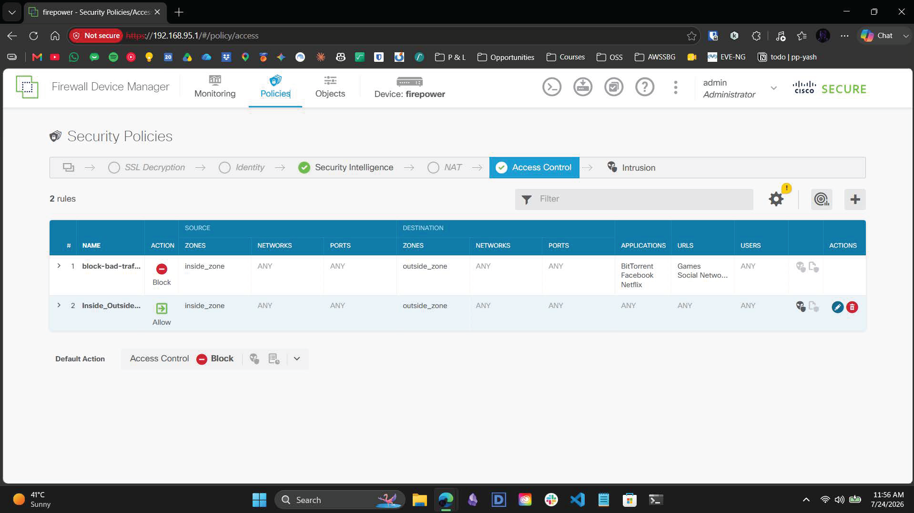
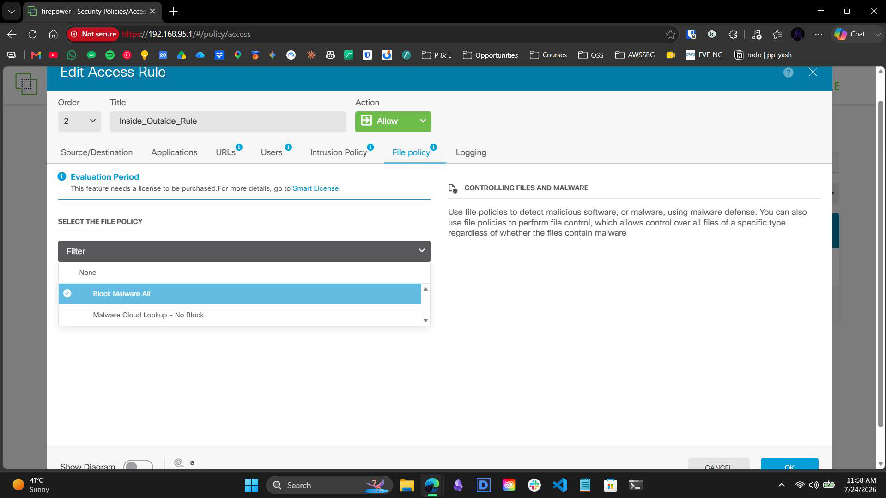
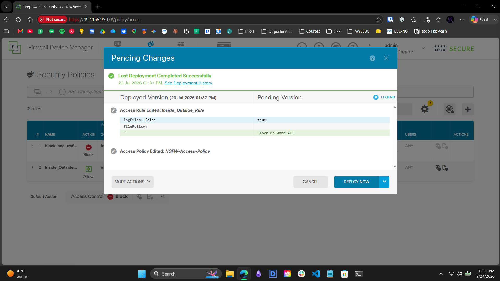

# 3.5 – Infrastructure Build Guide: Malware Defense & TLS Constraints

> A visual narrative documenting the deployment of Layer 7 file control, dynamic malware defense, and the practical validation of DPI constraints against encrypted transit payloads.

---

## Overview

This guide provides a comprehensive breakdown of integrating Cisco's dynamic malware defense matrix via the Firepower Device Manager (FDM). It details the configuration of file policies and explores real-world evasion scenarios—specifically highlighting the architectural blindness of Deep Packet Inspection (DPI) engines to TLS-encrypted traffic.

---

## Workflow Steps

### 1. Act I: Policy Binding & Engine Activation
The objective was to deploy advanced file control and dynamic malware analysis on perimeter transit traffic. 

*Initial view of the FDM Access Control matrix prior to file policy integration, showing the restrictive `block-bad-traffic` rule and the permissive `Inside_Outside_Rule`.*

*Within the Access Control matrix, the system-defined `Block Malware All` file policy was actively bound to the permissive `Inside_Outside_Rule`. This configuration primes the ASIC to intercept common file types (PDFs, Executables, Archives), calculate transit SHA-256 hashes, and perform real-time threat lookups against the Cisco Talos malware database.*

### 2. Act II: ASIC Hardware Deployment
With the file policy mapped to the transit rule, the configuration required compilation.

*The Pending Changes window displaying the deployment diff. The `Inside_Outside_Rule` was updated to activate logging (`logFiles: true`) and successfully bound the `Block Malware All` policy before being pushed to active hardware memory.*

### 3. Act III: The Upstream Proxy Trap
To validate the drop mechanics, an HTTP GET request was initiated from the internal zone targeting the standard EICAR malware test string. 

The request was immediately intercepted by an upstream corporate proxy residing on the external guest Wi-Fi network. The proxy served a `403 Forbidden` HTML error page in lieu of the malicious payload. Because the firewall correctly identified the transit payload as harmless HTML rather than a malicious file, the traffic was permitted without generating an intrusion or malware event. This identified a common false-negative trap in nested perimeter environments.

### 4. Act IV: The TLS Encryption Constraint
To bypass the upstream proxy, a direct command-line `curl` request was executed targeting a modern EICAR mirror. 

The external web server enforced a `301 Redirect`, forcing the connection over an encrypted HTTPS (TLS) tunnel. Due to the encryption, the EICAR malware payload successfully traversed the firewall entirely undetected.

### 5. Act V: Architectural Conclusion
The test conclusively demonstrated a fundamental perimeter architecture constraint: **Layer 7 Deep Packet Inspection (DPI) and File Control policies are entirely blind to payloads encapsulated within end-to-end TLS encryption.** 

Unless an active Man-in-the-Middle (MitM) SSL decryption policy is instantiated to break open the cipher suites, the firewall routing engine can only evaluate the encrypted traffic against standard Layer 3/Layer 4 Access Control rules.

---

## Contact

For any questions or feedback, reach out:  
**Paarth Pandey** | [LinkedIn](https://www.linkedin.com) | [GitHub](https://github.com) | paarthdxb@gmail.com

---

> Author: Paarth Pandey
> 
> Enterprise IT/OT Infrastructure Security Lab Portfolio