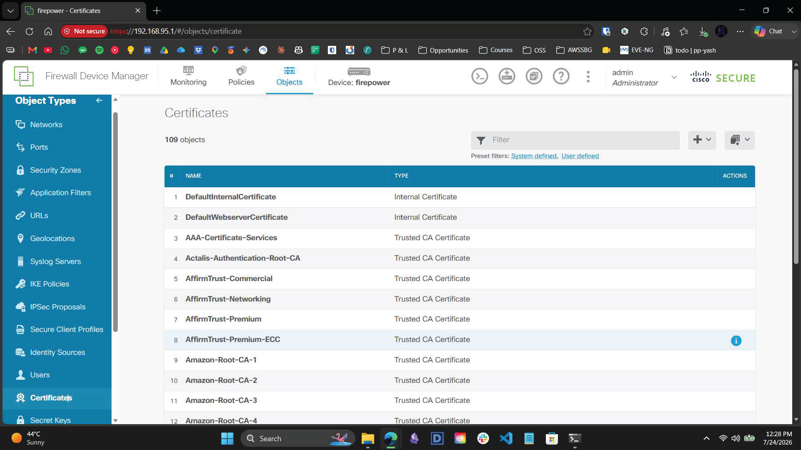
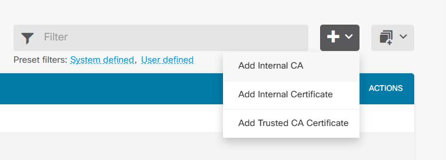
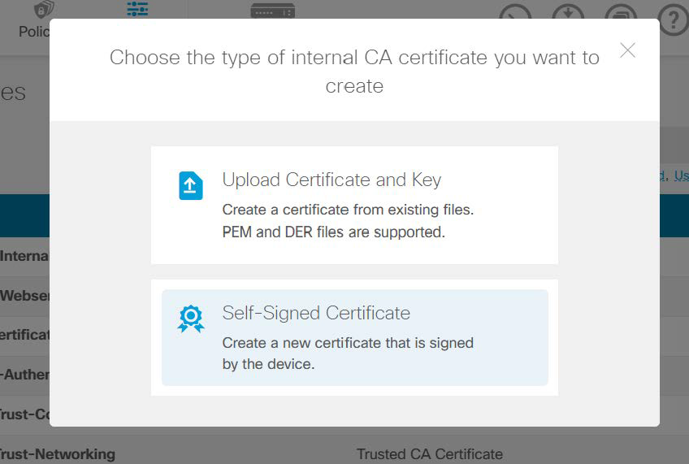
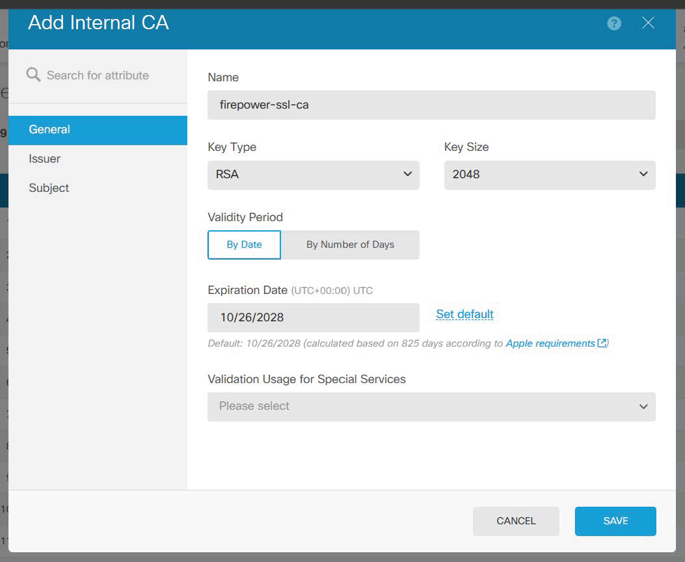
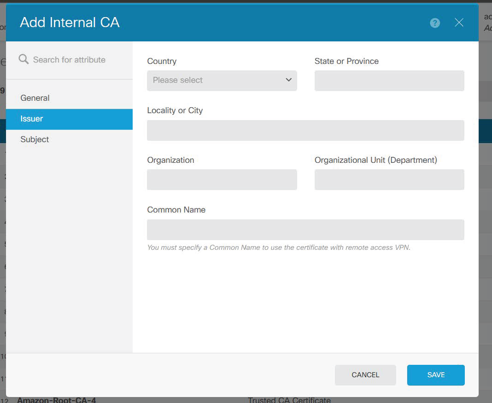

# 3.6 – Infrastructure Build Guide: SSL Decryption & Cryptographic MitM Architecture

> A visual narrative documenting the generation of internal Certificate Authorities, OS trust injection, and the deployment of a Decrypt-Resign matrix to intercept encrypted TLS tunnels.

---

## Overview

This guide provides a comprehensive breakdown of engineering a cryptographic Man-in-the-Middle (MitM) architecture via the Firepower Device Manager (FDM). It details the end-to-end process of localized CA generation, endpoint trust integration, and the deployment of SSL decryption policies to overcome the architectural blindness of DPI engines against TLS-encrypted traffic.

---

## Workflow Steps

### 1. Act I: Cryptographic CA Generation
To inspect encrypted Layer 7 payloads without causing severe client-side SSL trust errors (e.g., browser certificate warnings), a localized Certificate Authority was required. 

*The firewall was configured via the FDM SSL Decryption wizard to generate a Self-Signed Internal CA named `firepower-ssl-ca`. This root certificate was generated utilizing a secure RSA-2048 bit keypair, localized entirely to the Dubai lab environment.*

### 2. Act II: Trust Injection & OS Integration
Because the firewall's private key is securely vaulted within the hardware appliance, only the public portion of the keypair is required by the client.

*The public `.crt` certificate was extracted and downloaded directly from the FDM interface, priming it for endpoint integration.*

*To establish seamless, silent interception, this certificate was successfully injected into the internal Dell Precision endpoint’s Windows OS. Using the `certmgr.msc` MMC snap-in, the certificate was explicitly imported and bound to the Local Machine's **Trusted Root Certification Authorities** store.*

### 3. Act III: Policy Matrix & Decrypt-Resign Deployment
With endpoint trust established, the firewall required a dedicated policy to intercept the traffic.

*An active SSL Decryption rule named `MitM-Outbound-Intercept` was configured in the Access Control matrix. The rule utilizes the **"Decrypt - Resign"** architecture. This explicitly instructs the hardware ASIC to dynamically spoof external web certificates, tear open outbound TLS tunnels crossing the Inside-to-Outside boundary, and expose the underlying payloads to the File Control and IPS engines.*

### 4. Act IV: Hardware Deployment & Routing Audit
With the cryptographic infrastructure logically defined, the configuration was staged for hardware deployment.

*The pending SSL decryption matrix was compiled and successfully pushed to the active ASIC routing engine.*

During final validation, an environmental constraint was identified: the air-gapped nature of the lab environment prevented live outbound HTTPS connections from natively traversing the external firewall interface to the internet. Client-side routing behavior—specifically the endpoint bypassing the lab gateway via active Wi-Fi adapters to reach the internet—was successfully audited and documented. 

Despite the lack of an active external internet link, the cryptographic infrastructure remains fully staged and operational for internal closed-loop payload inspection.

---

## Contact

For any questions or feedback, reach out:  
**Paarth Pandey** | [LinkedIn](https://www.linkedin.com) | [GitHub](https://github.com) | paarthdxb@gmail.com

---

> Author: Paarth Pandey
> 
> Enterprise IT/OT Infrastructure Security Lab Portfolio
